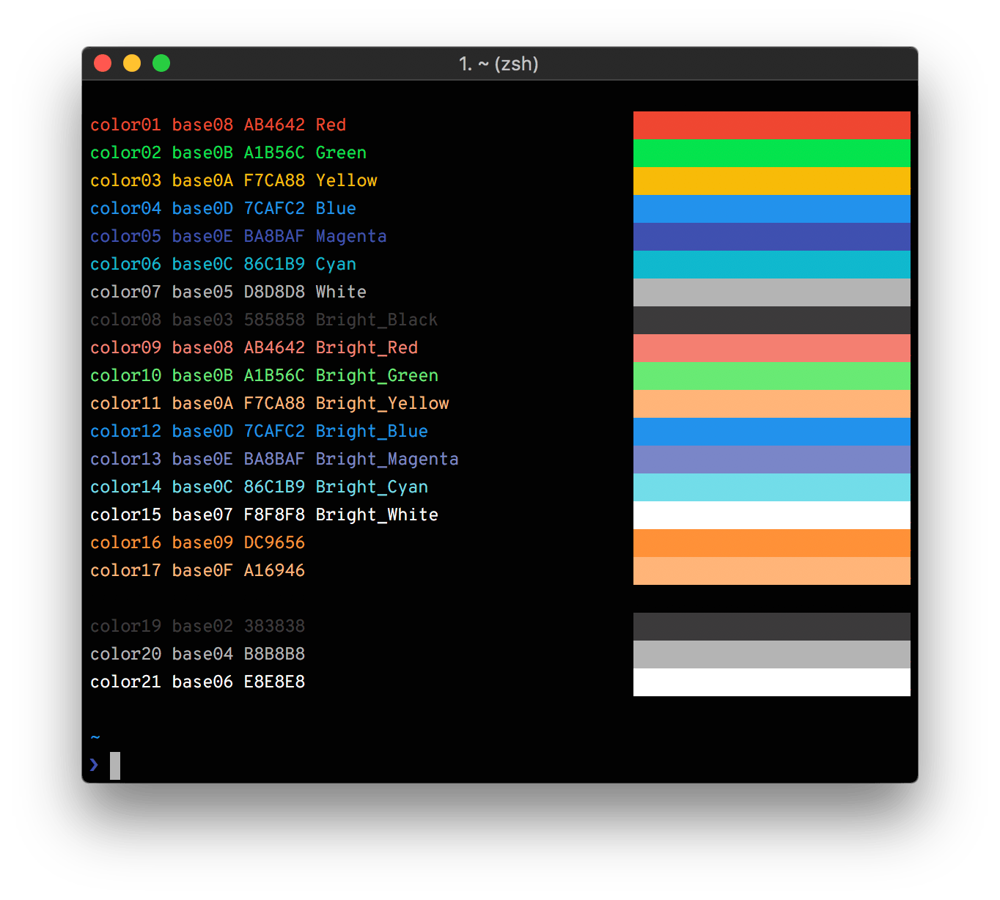

# base16-tm

Base16 themes using [Thinking Machines](https://thinkingmachin.es) colors



## iTerm2

Open `base16-tm.itermcolors`

## Shell

1. Install [base16-shell](https://github.com/chriskempson/base16-shell)
1. `cp base16-tm.sh ~/.config/base16-shell/scripts/`
1. `base16_tm`

## Vim

```
Plug 'marksteve/base16-vim'

let base16colorspace=256
colorscheme base16-tm
```

If you're using base16-shell:

```
if filereadable(expand("~/.vimrc_background"))
  let base16colorspace=256
  source ~/.vimrc_background
endif
```
